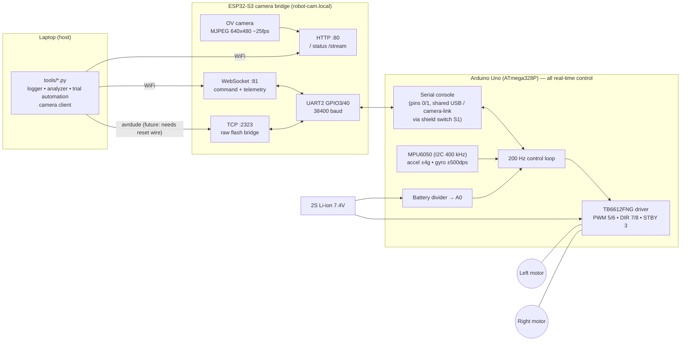
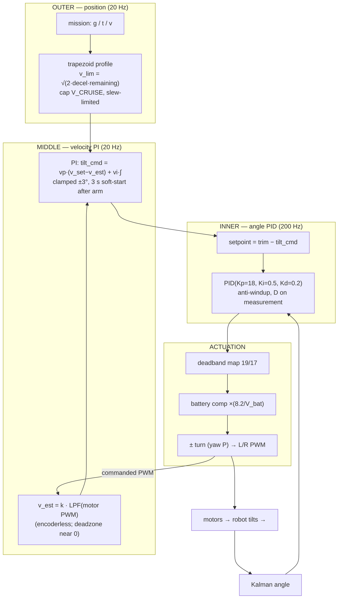
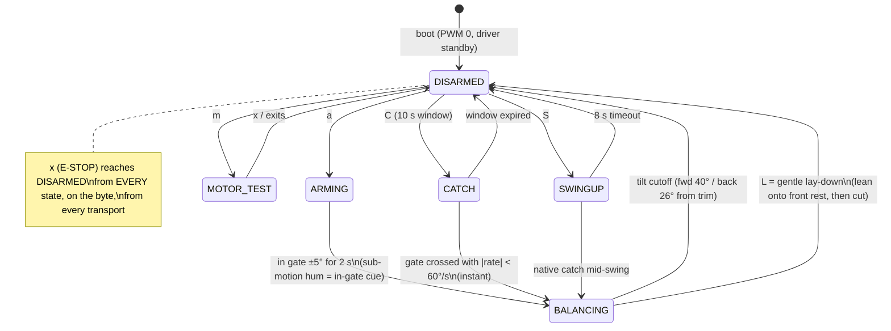

# Design Notes — Self-Balancing Robot

How this robot balances, how the control system is structured, and how the
code got to its current state. Everything here is grounded in measurements
recorded in `logs/` and the commit history; where a design choice was
forced by an experiment, the trial number is cited.

- Firmware (Arduino Uno): `self_balancing_robot.ino`, `MPU6050.*`,
  `kalman.h`, `PIDController.*`, `MotorDriver.*`
- Camera/WiFi bridge (ESP32-S3): `esp32_cam_bridge/`
- Host tooling (Python): `tools/`

---

## 1. System architecture



Division of labor (a deliberate, latency-driven boundary):

- **The Uno owns every fast loop.** Balance control runs at 200 Hz with
  5002 ± 6 µs measured jitter. Nothing that must react in milliseconds
  ever crosses the WiFi link.
- **The ESP32 is a dumb, reliable pipe** — camera out, console through.
  It contains no control logic on purpose: one line of "smarts" on the
  bridge is one more thing that can kill a balancing robot when WiFi
  hiccups. Its only autonomous act is safety-flavored: when the last
  WebSocket client disconnects, it injects an e-stop frame (`$x*78`) so
  the robot is never driven with nobody attached.
- **The laptop is eyes and judgment**: logging, analysis, trial
  orchestration, and (per PLAN.md) the future ROS2/vision stack.

### 1.1 Console protocol (one protocol, three transports)

The same line-oriented console reaches the Uno over USB serial, over
WiFi→UART, and (historically) whatever else can move bytes:

- Plain lines: `p 18`, `a`, `g 80`, `?` …
- Checksummed frames: `$<payload>*<XX>` where `XX` = hex XOR of payload
  bytes. The WiFi path uses frames; the parser accepts both
  interchangeably (`parseLine()`), so a corrupted radio byte is rejected
  rather than obeyed.
- `x` is special: it e-stops **on the byte**, even mid-line, on every
  transport. Emergency stop never waits for a newline.
- Console output: human lines start with `# `; bare CSV lines are
  telemetry (17 columns, header in `TELEM_HEADER`), so a logger can
  capture both streams from one pipe.

---

## 2. The balancing problem

A two-wheeled robot is an inverted pendulum on a cart. It cannot be
statically stable: the only way to stay up is to *drive the wheels toward
the fall* so the base stays under the center of mass, continuously,
forever. Two facts dominate everything in this codebase:

1. **The plant is fast.** With the center of mass a few cm above the
   axle, the natural fall time constant is on the order of 100 ms. The
   controller must sense, decide, and act many times within that window —
   hence 200 Hz and an obsession with loop-timing hygiene.
2. **The actuators are awful** (lovingly). Cheap geared DC motors with a
   ~19-count PWM deadband, ±2° of gear backlash, torque that sags with
   battery voltage, and no encoders. Half the engineering below exists to
   feed a clean control signal through dirty actuators.

---

## 3. Sensing: IMU → Kalman filter

### 3.1 Geometry and calibration (measured, not assumed)

- IMU X axis lies **along the wheel axle**; pitch (falling) is rotation
  about X. The original code fed the **Y** gyro to the filter — one of
  the two root causes of the robot's early "barely balances" reputation
  (found empirically in trial 014 by rocking the robot by hand and
  correlating each gyro axis against the accel-angle derivative).
- Tilt angle from the accelerometer: `atan2(ay, az)` — scale-free, so it
  survived even when the ranges were wrong.
- The gyro **scale is not datasheet**: integrating gx across hand-tilts
  and comparing with the accel angle change between stationary holds gave
  a constant ratio 1.335 (nine tilts, both directions). The code uses the
  measured 49.06 LSB/°/s, not the nominal 65.5. (The Z gyro is *worse* —
  scale unstable ±34 %, logs 046–050 — which is why turns await an IMU
  swap.)
- `MPU6050::init()` does a full DEVICE_RESET + signal-path reset and
  configures ±4 g / ±500 dps / 44 Hz DLPF explicitly. The chip's
  power-on default (±2 g, ±250 dps) silently halved every reading in the
  original code — root cause #2 of "barely balances."
- Gyro bias: 500-sample average at boot, **rejected if the robot moved**
  (pitch-gyro span gate), with the last good bias persisted in EEPROM as
  a fallback — because the board resets on every serial-port open and
  boot often happens mid-handling.
- A **freshness watchdog** disarms instantly if all six raw values are
  bit-identical for 0.5 s: this clone's measurement core can freeze while
  its I2C interface keeps answering (observed repeatedly), and frozen
  data defeats the tilt cutoff.

### 3.2 The 1-D Kalman filter (`kalman.h`)

State: `[angle, gyro_bias]`. Each 5 ms step:

```
predict:  angle += (gyro_rate - bias)·dt          // integrate the gyro
update:   y = accel_angle - angle                  // innovation
          angle += K0·y ;  bias += K1·y            // correct with accel
```

with `Q_angle = 0.001`, `Q_bias = 0.003`, `R = 0.03`. Intuition: the gyro
is trusted over milliseconds (smooth, fast, but drifts), the
accelerometer over seconds (absolute, but noisy and corrupted by every
acceleration). Measured at rest: raw accel angle σ = 0.124°, fused angle
σ = 0.017° — a ~7× noise reduction with bias self-tracking.

One non-obvious property that became load-bearing: the filter's small lag
at ~10 Hz *is the D-term's noise filter* (see §4.3).

---

## 4. Control: the cascaded loops



### 4.1 The inner angle PID — how it actually works

`PIDController::compute(setpoint, angle, rate, dt)` at 200 Hz:

**P — the muscle.** `P = Kp · (setpoint − angle)`. Falling forward makes
the error positive, which drives the wheels forward, which pushes the
base back under the center of mass. Kp sets how hard the robot fights per
degree of lean. Too low: it falls limply (trial 017's cousin at low
gains). Too high: every sensor wiggle becomes a motor slam. The floor
found Kp = 15 pre-ruler and Kp = 18 after the ruler bumper raised the
pitch inertia — exactly the direction physics predicts (more inertia
needs more authority).

**I — the surveyor.** `I += Ki·err·dt`, clamped. Its real job here is not
textbook steady-state error but **finding the true balance point**: if
the mechanical trim is off by 1°, P+D will hold the robot leaning 1°
wrong, permanently accelerating; the integral slowly absorbs that offset.
Two implementation details that matter:

- The accumulator stores `Ki·∫err` (pre-multiplied), so retuning Ki live
  over the console doesn't kick the output.
- It is clamped to the output range — anti-windup. Without it, one
  disturbance leaves a huge stored integral that slams the robot the
  other way (the original code had none; the old 25/5/0.5 gains'
  violence, trial 018, was largely windup).

Ki is deliberately small (0.5): trial 022 showed Ki = 1.5 turning the
trim search into a slow growing oscillation.

**D — the shock absorber, with a scar.** `D = −Kd · d(angle)/dt` opposes
the *rate* of tilting: it catches the fall early, before the angle error
grows. The implementation differentiates the **Kalman angle**
(derivative-on-measurement — immune to setpoint steps from the velocity
loop). The scar: an "obviously better" version fed the raw gyro rate to D
(clean, lag-free!) and the robot toppled in seconds, repeatably (trial
057 vs trial 051). Post-mortem: the loop has a ~10–15 Hz chatter mode
(deadband bang-bang + backlash, see PLAN.md); the Kalman filter's small
lag/attenuation at that frequency was quietly keeping the D term from
amplifying it, and the raw rate removed that protection. The lag was
load-bearing. Kd ≥ 0.5 destabilizes for the same reason even with the
filtered derivative (trials 019/020). Current Kd = 0.2.

**Trim — where "upright" actually is.** The setpoint is not 0°: it is the
angle at which the center of mass sits over the axle, currently **+15°**
(the robot visibly leans back — the front camera and history of mass
changes moved the CoM). Trim has been the single most trouble-making
scalar in the project: hand-held capture read 2.22° when the truth was
6.0 (grip bias); a free-standing measurement read 8.6 biased by the USB
cable acting as a kickstand; the camera mount moved it to ~15; a
front-mounted ruler once moved it to 22 until the ruler was re-centered.
Lesson encoded in CLAUDE.md: trim is measured from *trial data* (which
way it sprints) and free-standing rests, never from hand feel alone.

### 4.2 Why a cascade at all

The angle PID alone balances but cannot *stand still*: an inverted
pendulum is perfectly happy balancing while translating at constant
velocity, so any tiny bias becomes a slow drift, then speed, then a fall
at the motor's velocity ceiling (trial 045 run 2 — the "runaway"
limitation). The middle loop closes velocity: with no encoders, wheel
speed is **estimated from the commanded PWM** through a 0.4 s low-pass
(motor gain k measured by webcam-tracking the wheels: 0.155/0.118
cm/s/count L/R — `logs/sysid_002.json`), with a deadzone so hover jitter
doesn't integrate into phantom distance (trial 052 logged −75 fictitious
cm before that fix). The velocity PI then *leans the setpoint*: to slow a
forward drift, command a slightly backward tilt. Its integral doubles as
an online trim re-estimator (drift → sustained tilt command → equivalent
to trim correction).

Two hard-won safety rails on this loop:

- **±3° tilt authority clamp** — the velocity loop may nudge, never
  command a dive.
- **3-second soft-start after arming** (trial 058): the release transient
  reads as "speeding forward"; an eager velocity loop demands backward
  lean, which a non-minimum-phase plant can only achieve by first
  accelerating *forward*, which reads as more speed… every arm ended in
  a full-throttle faceplant until the loop learned to wake up slowly.

The outer layer is straightforward by comparison: dead-reckoned distance
(∫v_est), trapezoidal velocity profiles for `g <cm>` (brake early — a
balancer must lean backward to stop), yaw-hold differential steering, and
a slew limit so the balance loop never sees a setpoint step.

### 4.3 Actuation shaping — feeding clean control through dirty motors

Between PID output and PWM pins (`MotorDriver::drive`):

1. **Deadband mapping**: output ±1 maps to the measured breakaway PWM
   (19/17), so small corrections actually produce torque instead of
   silence. Measured per-wheel by slow ramps with human/webcam
   confirmation; re-measured when the battery state changes regime.
   (Known cost: the 0→19 step at each sign reversal is the primary
   jitter source — PLAN.md objective A replaces it with a soft blend.)
2. **Battery-sag compensation**: multiply by `8.2 V / V_battery` (A0
   divider, 2 Hz sampling) so a commanded correction delivers the same
   torque at 7.0 V as at 8.2 V. Before this existed, every long session
   ended with "the same gains got mysteriously worse" (trials 022/023/
   059 — always the battery).
3. **Direction convention** in exactly one place (`MOTOR_SIGN_*`),
   verified end-to-end in hardware: tilt forward → wheels drive toward
   the fall (trial 016: visual + telemetry sign agreement).

---

## 5. Safety state machine



Design rules that shaped it:

- **Disarmed at boot, always.** The very first firmware change ever made
  (the stock code drove motors at power-on). Reconnecting a battery must
  never cause motion.
- Arming requires *demonstrated* stability (2 s inside the gate) — except
  `C`/`S`, which exist precisely because a swinging robot crosses the
  gate in ~100 ms; they trade the dwell requirement for a rate limit.
- The tilt cutoff is asymmetric because the mechanics are: the rear
  bumper tip grounds at +43° absolute (~+28 from trim) and motors must
  cut *before* the robot beaches on it with wheels spinning.
- `L` (lay-down) exists because an uncontrolled disarm-drop once twisted
  the robot into a side-fall — the one pose a two-wheeler cannot recover
  from alone. Sessions end by leaning deliberately onto the front bumper
  rest, which doubles as the swing-up launchpad.

## 6. Self-erection (swing-up)

From a bumper rest (~±40°), `S` runs a bang-bang energy pump under the
200 Hz loop: drive forward while the body moves toward upright, coast
while it swings away, **coast entirely within 18° of the top** (the
taper — without it the robot pumped itself straight through the catch
gate at >60°/s, trial 067), then the native catch hands off to the
balance PID. Forward drive lifts from *both* rest sides (wheel torque
reaction dominates), measured empirically. The pump is feedback, not a
calibrated kick, because open-loop kick strength proved hopeless: it
sits on a stiction cliff that moves with motor temperature and battery
voltage (three campaigns' worth of evidence, logs 063–072).

## 7. How the code was built — the empirical method

The project's ground rule: **never guess-and-flash**. Every firmware
iteration logs 17-column CSV telemetry; every tuning decision cites the
previous log. The tools grew alongside:

- `tools/log_trial.py` — logger + live console (with its own war stories:
  V4L2-style stale reads, Python stdin buffering delaying commands by
  minutes — both found by comparing what the human saw against what the
  data claimed).
- `tools/analyze.py` — oscillation frequency, ripple, settling, drift,
  saturation, loop-timing health per trial.
- `tools/balance_trial.py` — one command per physical trial: set gains,
  wait for arm, log, analyze, propose the next single change per the
  protocol, append to the tuning journal.
- `tools/sysid.py` — webcam wheel-speed measurement (blue-marker orbit
  tracking with a radius gate; manual camera exposure because motion blur
  fakes "not rotating" above ~0.3 rev/s).

The debugging pattern that recurs throughout the history: *when the data
and the human disagree, suspect the instrument.* The gyro axis bug, the
gyro scale factor, the frozen-IMU watchdog, the stale-camera-frame
verdicts, the "dead motors" that were motion-blur artifacts — each was
cracked by cross-checking telemetry against physical ground truth (a
hand on the robot, an eye on the wheel), then encoding the check into
firmware or tooling so it could never lie the same way twice.

Chronology of the load-bearing discoveries (all in `git log` /
CLAUDE.md):

1. Disarm-at-boot + console + telemetry (safety and observability first).
2. MPU ranges unconfigured (2× scale error) and wrong pitch axis — fixed;
   the robot's sensing was half-blind and sideways all along.
3. Fixed 5 ms loop; anti-windup; deadband mapping; direction verified.
4. Trim saga → floor-measured 6.0; Phase 2 gains 15/0.5/0.2 → 46 s.
5. Velocity loop + soft-start → 90 s station-keeping; runaway solved.
6. Battery divider + sag compensation → session-long consistency.
7. Wireless bridge (correct UART pins from Elegoo's own source; 38400
   through the level shifter) → untethered; camera mass moved trim.
8. Catch mode, swing-up, lay-down → full autonomous life cycle:
   *wake → balance → work → park*, 93.6 s record run.

What it is now: a robot that picks itself up, balances with a documented
noise budget, drives on estimated odometry, parks itself, and streams
its own view — with every capability traceable to the trial that forced
it.
